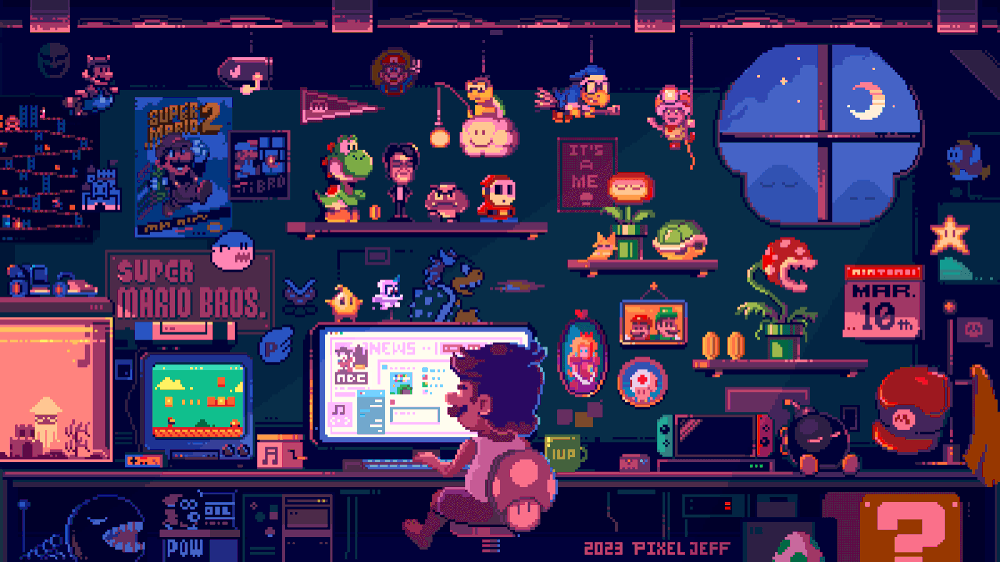

---

<h1 align="center">HI, I'M COLLINS RUTO 👋</h1>

### Full-Stack Software Engineer • SaaS & Payments Systems

#### Building reliable SaaS platforms and secure payment systems.
  
  

  <a href="https://collinsruto.vercel.app/">Website</a> •
  <a href="https://collinsruto.vercel.app/projects">Projects</a> •
  <a href="https://collinsruto.vercel.app/blogs">Blogs</a> •
  <a href="mailto:collinsruto48@gmail.com">Email</a> •
  <a href="https://twitter.com/ruto_collins_">Twitter</a> •
  <a href="https://www.linkedin.com/in/collins-ruto/">LinkedIn</a> •
  <a href="https://instagram.com/colins_ruto">Instagram</a>

#### Quick Tags

---

## Who I am

Software Engineer & Designer based in **Nairobi, Kenya**.  
I help individuals and businesses turn ideas into scalable, production-ready web applications.  

I focus on performance, reliability, and building systems that are genuinely useful, not just impressive demos.

### 🛠️ What I Do

---

**🏗️ Product Engineering**  
I build web applications end-to-end: UI, data models, APIs, and deployment. My focus is on clarity, reliability, and writing maintainable code that scales.

**⚙️ Backend & APIs**  
I design REST APIs, database schemas, and background workflows. I am proficient in Node.js, Firebase, SQL/NoSQL, and serverless deployments via Vercel.

**💳 Payments & Integrations**  
Experienced in integrating payment systems like **M-Pesa (Daraja)** and **KCB Buni**. I handle real-time callbacks, reconciliation flows, idempotency safeguards, and production edge cases to ensure payment systems remain reliable and secure.

## GitHub Stats

<!--  -->

<!-- 

  
  

 -->

## Technical Stack

<!-- links takes you to repositories -->
There are much more, these are just the few that I got icons for.

### Frontend Development

### Backend & Logic

### Database & Infrastructure

### Tools & Environment

---

<b> Featured work</b>

 

- **Eldama Ravine Education Foundation (EREF)** - Official website  
  Tech: HTML, JavaScript, TailwindCSS, Supabase, M-Pesa API  
  Demo/Source: <https://ereffoundation.org>

- **Uzalendo School** - Official website  
  Tech: HTML, CSS, JavaScript, TailwindCSS, Email  
  Demo/Source: <https://ereffoundation.org/uzalendo.html>

- **LearnHq** - Full-scale school & learning management system  
  Tech: Next.js, TypeScript, MongoDB, tRPC, TailwindCSS, HygraphCMS  
  Demo: <https://learnhq.vercel.app> • Source: <https://github.com/collins-ruto/LearnHq>

## 🔍 Beyond the Code

My journey started with an old IBM computer and a lot of curiosity in Microsoft Paint. Today, I balance my love for engineering with several hobbies:

- 🚢 **Marine Engineer:** Graduate in the mechanics of the sea.
- 🐕 **Dogs:** Big fan of furry companions.
- ☕ **Coffee & Tea:** The fuel behind every successful `git commit`.
- 🔭 **Astro:** Obsessed with space documentaries and classic music.

  Stay curious. Keep building. 🚀

